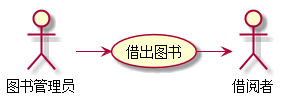

<<<<<<< Updated upstream
# 实验二：图书管理系统用例建模
学号|班级|姓名|
|:-------:|:-------------: | :----------:|
|201510414220|软件(本)15-2|巫恒强|

***
## ===以下为本次作业===
- - -
# 实验二：图书管理系统用例建模
## 1.图书管理系统的用例关系图
### 1.1用例图PlantUML源码如下：
 @startuml
 left to right direction
 skinparam packageStyle rectangle
 actor 读者 as d
 actor 图书管理员 as t
 actor 系统管理员 as x
 rectangle 图书管理系统用例图{
 
     d --> (查询借阅信息)
     d --> (预定图书)****
     (预定图书)<..(取消预订):<<include>>
     d --> (借书)
     (借书)<..(续借):<<include>>
     d --> (还书)
     (还书)<..(交罚金):<<extend>>
     d --> (注册)
     d --> (修改个人信息)
     d --> (查询图书信息)
     d --> (登录)
 
     t --> (修改个人信息)
     t --> (查询图书信息)
     t --> (登录)
     t --> (添加图书)
     t --> (修改（删除）图书)
     t --> (解除预定)
     t --> (允许还书)
     (允许还书)<..(收罚金):<<extend>>
     t --> (允许借书)
     (允许借书)<..(允许续借):<<include>>
 
     (发布新公告) <-- x
     (管理图书管理员) <-- x
     (管理读者) <-- x
     (维护系统) <-- x
     (登录) <-- x
     (添加图书) <-- x
     (修改（删除）图书) <-- x
 }
 @enduml
### 1.2用例图如下：


## 2.参与者说明
### 2.1 系统管理员
主要职责是：
- 主要对系统有维护工作:对系统进行优化处理,排除bug处理,对系统的各种功能进行完善,提高用户的体验。
- 和图书管理员以及用户进行沟通，管理图书系统。
### 2.2 图书管理员
主要职责是：

- 与系统管理员进行沟通，完善系统。
- 对读者的借书、还书、挂失卡等操作，对读者的业务进行操作。
- 对超时的借书用户进行罚款操作。
### 2.3 借阅者
主要职责是：
- 可以通过查询图书并借取或者归还图书。
- 可查询自己的借阅情况。
- 若借记卡不慎丢失，可进行挂失并找系统管理员进行补卡操作。
- 按时还书，否则或造成逾期罚款。
## 3.用例规约表
### 3.1 "借出图书"用例
|Title | 内容 |
|:------:|:------:|
|用例名称|借出图书|  
|参与者|图书管理员（主要参与者）、借阅者（次要参与者）|
|前置条件|图书管理员已被识别和授权|
|后置条件|存储借书记录，更新库存数据，所借图书状态为借出|
|主事件流|1.图书管理员将读者借书卡提供给系统；<br>2.系统验证读者身份和借书条件；<br>3.图书管理员将读者所借图书输入系统；<br>4.系统记录借书信息，并且修改图书的状态和此书的可借数量；<br>5系统累加读者的借书数量；<br>6.重复3~5，直到图书管理员确认全部图书登记完毕；<br>7.系统打印借书清单，交易成功完成|
|备注|图书馆每本书都是可验证的|
 ### 3.2 "归还图书"用例
 |Title | 内容 |
 |:------:|:------:|
 |用例名称|归还图书|  
 |参与者|图书管理员（主要参与者）、借阅者（次要参与者）|
 |前置条件|图书管理员已被识别和授权|
 |后置条件|存储还书记录，更新库存数据，所借图书状态为未借出|
 |主事件流|1.图书管理员将读者借书卡提供给系统；<br>2.系统验证读者身份和还书条件；<br>3.图书管理员将读者所借图书输入系统；<br>4.由系统计算出图书所借日期是否逾期，若逾期则需要借阅者缴纳逾期罚款；<br>5.系统记录还书信息，并且修改图书的状态和此书的可借数量；<br>6.系统打印还书清单，交易成功完成|
 |备注|还书须由图书管理员完成|

 ### 3.3“归还图书”用例流程图源码如下：
 ```
 @startuml
:图书管理员: as Admin
:借阅者: as User
left to right direction
rectangle {
Admin -->(归还图书)
(超期罚款).>(归还图书):<<extends>>
(归还图书) <--User********
}
@enduml
 ```
### 3.3.1“归还图书”用例流程图如下：


### 3.4“借出图书”用例流程图源码如下：
 ```
 @startuml
:图书管理员: as Admin
:借阅者: as User
left to right direction
rectangle {
Admin -->(借出图书)<--User
}
@enduml
 ```
### 3.4.1“借出图书”用例流程图如下：
=======
# 实验二：图书管理系统用例建模
学号|班级|姓名|
|:-------:|:-------------: | :----------:|
|201510414220|软件(本)15-2|巫恒强|

***
## ===以下为本次作业===
- - -
# 实验二：图书管理系统用例建模
## 1.图书管理系统的用例关系图
### 1.1用例图PlantUML源码如下：
 @startuml
 left to right direction
 skinparam packageStyle rectangle
 actor 读者 as d
 actor 图书管理员 as t
 actor 系统管理员 as x
 rectangle 图书管理系统用例图{
 
     d --> (查询借阅信息)
     d --> (预定图书)****
     (预定图书)<..(取消预订):<<include>>
     d --> (借书)
     (借书)<..(续借):<<include>>
     d --> (还书)
     (还书)<..(交罚金):<<extend>>
     d --> (注册)
     d --> (修改个人信息)
     d --> (查询图书信息)
     d --> (登录)
 
     t --> (修改个人信息)
     t --> (查询图书信息)
     t --> (登录)
     t --> (添加图书)
     t --> (修改（删除）图书)
     t --> (解除预定)
     t --> (允许还书)
     (允许还书)<..(收罚金):<<extend>>
     t --> (允许借书)
     (允许借书)<..(允许续借):<<include>>
 
     (发布新公告) <-- x
     (管理图书管理员) <-- x
     (管理读者) <-- x
     (维护系统) <-- x
     (登录) <-- x
     (添加图书) <-- x
     (修改（删除）图书) <-- x
 }
 @enduml
### 1.2用例图如下：


## 2.参与者说明
### 2.1 系统管理员
主要职责是：
- 主要对系统有维护工作:对系统进行优化处理,排除bug处理,对系统的各种功能进行完善,提高用户的体验。
- 和图书管理员以及用户进行沟通，管理图书系统。
### 2.2 图书管理员
主要职责是：

- 与系统管理员进行沟通，完善系统。
- 对读者的借书、还书、挂失卡等操作，对读者的业务进行操作。
- 对超时的借书用户进行罚款操作。
### 2.3 借阅者
主要职责是：
- 可以通过查询图书并借取或者归还图书。
- 可查询自己的借阅情况。
- 若借记卡不慎丢失，可进行挂失并找系统管理员进行补卡操作。
- 按时还书，否则或造成逾期罚款。
## 3.用例规约表
### 3.1 "借出图书"用例
|Title | 内容 |
|:------:|:------:|
|用例名称|借出图书|  
|参与者|图书管理员（主要参与者）、借阅者（次要参与者）|
|前置条件|图书管理员已被识别和授权|
|后置条件|存储借书记录，更新库存数据，所借图书状态为借出|
|主事件流|1.图书管理员将读者借书卡提供给系统；<br>2.系统验证读者身份和借书条件；<br>3.图书管理员将读者所借图书输入系统；<br>4.系统记录借书信息，并且修改图书的状态和此书的可借数量；<br>5系统累加读者的借书数量；<br>6.重复3~5，直到图书管理员确认全部图书登记完毕；<br>7.系统打印借书清单，交易成功完成|
|备注|图书馆每本书都是可验证的|
 ### 3.2 "归还图书"用例
 |Title | 内容 |
 |:------:|:------:|
 |用例名称|归还图书|  
 |参与者|图书管理员（主要参与者）、借阅者（次要参与者）|
 |前置条件|图书管理员已被识别和授权|
 |后置条件|存储还书记录，更新库存数据，所借图书状态为未借出|
 |主事件流|1.图书管理员将读者借书卡提供给系统；<br>2.系统验证读者身份和还书条件；<br>3.图书管理员将读者所借图书输入系统；<br>4.由系统计算出图书所借日期是否逾期，若逾期则需要借阅者缴纳逾期罚款；<br>5.系统记录还书信息，并且修改图书的状态和此书的可借数量；<br>6.系统打印还书清单，交易成功完成|
 |备注|还书须由图书管理员完成|

 ### 3.3“归还图书”用例流程图源码如下：
 ```
 @startuml
:图书管理员: as Admin
:借阅者: as User
left to right direction
rectangle {
Admin -->(归还图书)
(超期罚款).>(归还图书):<<extends>>
(归还图书) <--User********
}
@enduml
 ```
### 3.3.1“归还图书”用例流程图如下：


### 3.4“借出图书”用例流程图源码如下：
 ```
 @startuml
:图书管理员: as Admin
:借阅者: as User
left to right direction
rectangle {
Admin -->(借出图书)<--User
}
@enduml
 ```
### 3.4.1“借出图书”用例流程图如下：
>>>>>>> Stashed changes
